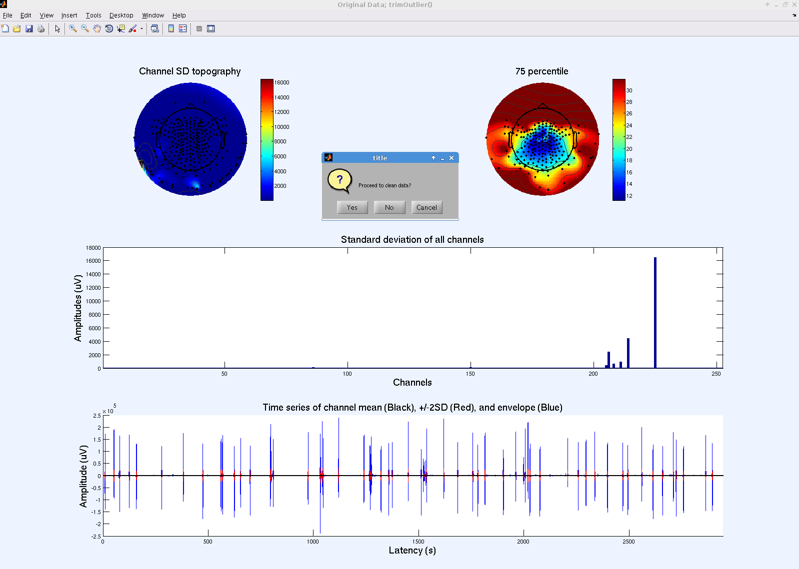
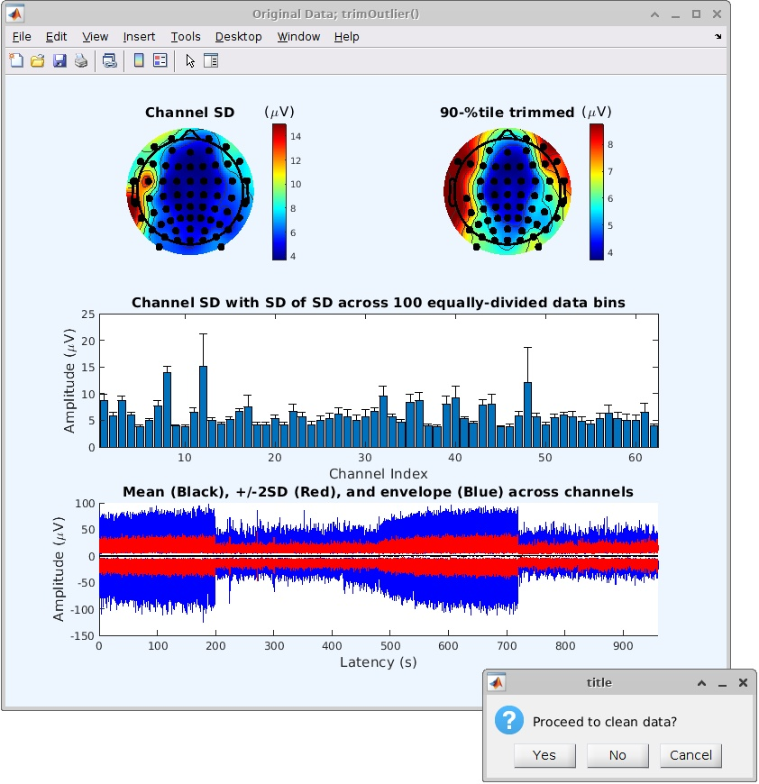

What is *trimOutlier*() for? (05/15/2019 updated)
-------------------------------------------------

-   **Powerful data surveyability**: It is probably the only tool, as
    far as I know, that allows to check ALL the channels and ALL the
    data points in one window. One can perform visual sanity check for
    outliers and data stationarity at a glance. It saves you from
    eyeballing hundreds of pages of raw EEG data.
-   **Simple data cleaning**: If you find a problem in your channels or
    time-series waveforms, you can seamlessly perform an essential-level
    data cleaning by chopping off bad channels/datapoints. Unlike
    [*clean_rawdata*()](https://sccn.ucsd.edu/wiki/Artifact_Subspace_Reconstruction_(ASR)),
    *trimOutlier*() does not add anything to data. Hence recommended for
    purists and skeptics of any automated data cleaning/correction
    algorithm. For example, if your cleaning strategy is a classical
    'rejected trials EEG exceeds +/- 200 uV', then *trimOutlier*() does
    the job for you. When called from GUI, it provides interactive and
    intuitive user environment with which one can determine rejection
    criteria based on feedback from cut-and-try processes.

Where is the rejection log stored? (05/15/2019 updated)
-------------------------------------------------------

It keeps a log in EEG.etc.trimOutlier.cleanChannelMask \[nbchan x 1
logical\] for channel rejection and EEG.etc.trimOutlier.cleanChannelMask
\[data_length x 1 logical\] for data point rejection.

Tutorial
--------

This tutorial assumes the user understands the basic steps of loading
data into EEGLAB. For more information, visit the [EEGLAB
tutorial](http://sccn.ucsd.edu/wiki/EEGLAB_Wiki#EEGLAB_Tutorial).

To begin, load a continuous (un-epoched) data set and start the plugin
under “Tools” of the EEGLAB window. Several figures and charts will pop
up along with a prompt to clean the data.

The top left scalp map shows the topography of channel SD during all
recording time, and the top right one shows the same image but after
removing the channels with top 25% highest SD. By comparing these two
scalp maps, you can see the scalp distribution of high amplitudes that
is usually associated with artifacts.

(05/14/2024 Updated)
Since 2019, the SD bar graph shows error bars that indicates 1 SD.
The SD of SD is calculated by dividing the data into 100 bins with
equal length with trimming, then calculate SD for each bin. My calculating
the mean and SD across the 100 SDs, you can get mean and SD of channel SD
values. This approach helps distinguish the following two cases:
(1) High-variance state is stationary (i.e. better to reject the channel;
in this case, the error bar is short); (2) High-variance state is transiend
(i.e. better to retain the channel; the error bar is long).

Before continuing by clicking “Yes,” be sure to study the graphs to
estimate threshold values. There is no need to worry about finding the
perfect threshold values on the first try however; again, an advantage
to this plugin is the interactive nature of the process.

The first input for filtering is the channel standard deviation upper
bound. For the example data set, we chose an upper bound of 200 MICROV
based on the “Standard deviation of all channels” graph. After clicking
“Ok,” the plugin generates a graph of channel standard deviation data
before and after rejection, and also displays the number of rejected
channels and asks for confirmation (names of channels removed will be
displayed during final step). New upper bound values may be chosen if
the number of rejected channels is too high; for our experiment, we were
comfortable with rejecting up to 10% of our channels.

If you have multiple subjects in your experiment you may wish to
determine a threshold common to all subjects. One way to do this is by
finding the standard deviation of the EEG data for each channel of each
subject and sorting the values, then examining the plot of all the
subject’s sorted data.

Click “Ok” again to confirm upper bound channel removal. A similar
process occurs for rejection based on lower bound. Enter a lower bound
value, click “Ok,” inspect the result, and alter the value or confirm by
clicking “Ok” again. While the upper bound is meant to take care of
“crazy” channels, the lower bound addresses “dead” channels. Therefore,
it is best to avoid using 0 as the lower bound. 2 MICROV is a good
value.

The next step is to reject data points. The colour key is the same as
the first image: black represents mean, red is +/- 2SD, and blue is the
envelope. Here we use a threshold value of 300 MICROV and a point spread
width of 1ms. Click “Ok,” and examine the “After datapoint rejection”
graph. Different values may be used for threshold and point spread width
if the rejection is not satisfactory. Finalize the process by
confirming.

 

Authors: Clement Lee and Makoto Miyakoshi. SCCN, INC, UCSD
